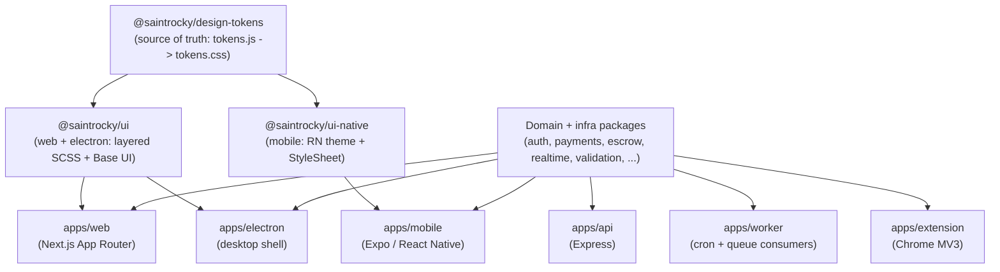

# saintrocky

A Yarn-workspaces monorepo powering a trading-discipline platform: a **web app**, **mobile app**, **desktop app**, **browser extension**, **HTTP API**, **background worker**, and an **on-chain Solana escrow program** — all sharing one design system and one domain layer instead of re-implementing the same logic six times.

The product lets traders define rules for themselves ("max 5 trades/day", "no trading between midnight and 8am", "block pump.fun"), enforces those rules proactively (extension blocks domains, desktop blocks apps) and detectively (Solana webhooks watch on-chain trades), and backs the whole thing with a real escrow smart contract that penalizes rule violations and redistributes fees to disciplined users. See [docs/architecture-solana-enforcement.md](docs/architecture-solana-enforcement.md) for the full enforcement data flow.

This README documents how the repository is organized and why, so a new engineer (or reviewer) can understand the whole system quickly.

---

## Architecture at a glance

The repo is organized as **apps that consume packages**, not as apps with duplicated logic. The single most important rule in the codebase: **`@saintrocky/design-tokens` is the one source of visual truth.** Every color, spacing value, radius, and type scale is defined once, in plain JS objects, and everything else derives from it.

- **`@saintrocky/design-tokens`** exports raw `lightTokens` / `darkTokens` objects (`src/tokens.js`) plus a compiler (`src/css.js`, run via `scripts/build-css.js`) that turns them into a generated `tokens.css` file of CSS custom properties (`--ui-bg`, `--ui-fg`, `--ui-radius`, ...). Nothing about a color lives in more than one place.
- **`@saintrocky/ui`** (web + Electron) imports `tokens.css` once, at the bottom of its layered SCSS pipeline (`base → primitives → compounds → layout → widgets`), and builds accessible React primitives on top of [Base UI](https://base-ui.com/). Styling hooks follow a consistent `ui-{Component}{Slot}` class convention so consuming apps can theme without fighting specificity.
- **`@saintrocky/ui-native`** (mobile) imports the *same* raw token objects via `getTokens(mode)` and turns them into a React Native theme (`src/theme.js`) consumed by `StyleSheet`-based primitives and compounds. There is no CSS on native, but the palette, spacing, and typography scale are identical to web because they're read from the same tokens.
- Change a hex value in `design-tokens` once, and the web app, the Electron shell, and the mobile app all pick it up — one visual source of truth across three renderers (DOM, DOM-in-Electron, and native views).
- Above the design layer sits a set of **domain packages** (auth, payments, escrow, enforcement, realtime, etc.) that encapsulate business logic so it is written once and imported by whichever app layer needs it — an Express API, a cron worker, a Next.js app, a React Native app, an Electron main process, or a Chrome extension background script.



In production, `apps/web` (Next.js) and `apps/api` (Express) don't even run as separate services: [server.mjs](server.mjs) mounts the Express API app as middleware in front of the Next.js request handler on a single `http.Server`, so the API, the SSR/RSC app, and the realtime WebSocket layer all share one process and one port. In development they run as two separate processes (`yarn dev:web`, `yarn dev:api`) for faster iteration.

---

## Monorepo layout

```
saintrocky/
├── apps/
│   ├── web/          # Next.js (App Router) — marketing + authenticated dashboard
│   ├── api/           # Express HTTP API — MongoDB, Redis, RabbitMQ, WebSockets
│   ├── worker/         # Cron jobs + RabbitMQ queue consumers (reuses apps/api)
│   ├── mobile/          # Expo / React Native app
│   ├── electron/         # Desktop app — app-blocking enforcement + shared @saintrocky/ui
│   ├── extension/         # Chrome MV3 extension — domain-blocking enforcement
│   └── blockchain/         # Anchor (Rust) Solana escrow program
├── packages/
│   ├── design-tokens/  ui/  ui-native/  icons/  branding/        # design system
│   ├── auth/  users/  payments/  billing/  booking/  escrow/     # domain logic
│   ├── chain/  wallet/  enforcement/  network-policies/          # domain logic (cont'd)
│   ├── workflows/  alerts/  notifications/  events/  chatbot/    # domain logic (cont'd)
│   ├── fuckyoupayme/                                             # product copy/scoring domain
│   ├── shared/  config/  api-client/  validation/  assets/       # platform / infra
│   └── storage/  cache/  logger/  realtime/  analytics/          # platform / infra (cont'd)
├── docs/               # deep-dive architecture docs (enforcement, Solana setup, quickstart)
├── scripts/            # repo tooling (project rename, package scaffolding)
└── server.mjs          # unified production entrypoint (API + Next in one process)
```

Route segments inside `apps/web/app` follow Next.js App Router conventions with route groups (e.g. marketing vs. authenticated areas) so public and dashboard concerns stay isolated while sharing the same layout primitives from `@saintrocky/ui`.

---

## Applications

- **`apps/web`** — Next.js (App Router) web client. Server Components by default; client components only where interactivity requires it. Styled entirely through `@saintrocky/ui`'s exported SCSS layers rather than app-level CSS. Uses `@saintrocky/api-client` for all network calls, never talking to Mongo/Redis directly.
- **`apps/api`** — Standalone Express server (`apps/api/src/index.js`, port `4000` in dev). MongoDB via Mongoose, Redis via `ioredis`, queues via `amqplib`/RabbitMQ, auth via JWT (`jsonwebtoken` + `bcryptjs`), transactional email via `nodemailer`, scheduled jobs via `node-cron`, and a `ws` WebSocket server for realtime fan-out. Route handlers stay thin; business logic lives in the domain packages listed below.
- **`apps/worker`** — Long-running process for cron jobs and RabbitMQ queue consumers. Depends directly on `@saintrocky/api` to reuse its services/models rather than duplicating them.
- **`apps/mobile`** — Expo-managed React Native app using `@react-navigation` for routing and `@saintrocky/ui-native` for every screen's visual layer, so mobile always matches the web/desktop palette.
- **`apps/electron`** — Desktop shell that reuses `@saintrocky/ui` directly (it's a Chromium renderer, same as the web app) and additionally runs a native process-watcher (`runtime-hub.js`) that polls visible applications to enforce "block this app" rules.
- **`apps/extension`** — Vite-built Chrome MV3 extension. A background service worker matches active browser tabs against a user's domain-blocking rules in realtime and renders an in-page block overlay.
- **`apps/blockchain`** — Anchor/Rust Solana program implementing the escrow vault: `PlatformConfig`, per-user `UserVault`, and a `FeePool` PDA, with instructions to deposit, withdraw, record penalties, and distribute rewards. See [docs/solana-escrow-setup.md](docs/solana-escrow-setup.md).

---

## Packages (`@saintrocky/*`)

Every package is consumed by two or more apps; nothing here exists for a single call site. Grouped by concern:

**Design system**
- `design-tokens` — raw token values (light/dark) and the CSS compiler; the single source of visual truth.
- `ui` — Base UI-powered React primitives, compounds, and layout components + SCSS for web/Electron.
- `ui-native` — React Native primitives/compounds/layout sharing the same tokens, for mobile.
- `icons` — SVG icon set with separate web (`web.jsx`) and native (`index.native.js`) entrypoints.
- `branding` — brand constants (names, wordmarks, copy) shared across every surface.

**Domain**
- `auth`, `users` — identity, sessions, roles/permissions.
- `payments`, `billing` — payment processing and billing state.
- `booking` — scheduling/slot-engine logic.
- `escrow`, `chain`, `wallet` — Solana client SDK for the Anchor program, on-chain trade/program parsing, and wallet-linking hooks (`useWalletLink`, `useEscrowVault`, `SolanaWalletProvider`).
- `enforcement`, `network-policies` — rule-schedule evaluation (`isScheduleActive`) and target/domain matching shared by the extension, desktop, and chain watcher.
- `workflows`, `alerts`, `notifications`, `events` — cross-cutting orchestration, alerting, and push/email notification delivery.
- `chatbot` — client/server/shared code for the in-app support/rules assistant.
- `fuckyoupayme` — product-specific domain logic for violation messaging, discipline scoring, and copy ("problem index", metered violations, quotes).

**Platform / infrastructure**
- `shared` — rule-authoring engine, locale/i18n constants, marketing helpers, and other runtime utilities with no single "owning" domain.
- `config` — environment schema + `loadEnvFiles()`/runtime config shared by every Node process.
- `api-client` — typed HTTP client for the full API surface, consumed by web, mobile, electron, and the extension.
- `validation` — Yup schemas plus translated message keys, shared by both client-side forms and server-side request validation.
- `assets` — S3 upload helpers and presigned-URL flow.
- `storage` — key/value storage abstraction with web (`localStorage`) and native (`AsyncStorage`) backends behind one interface.
- `cache`, `logger`, `realtime`, `analytics` — Redis-backed caching, structured logging, the WebSocket pub/sub layer used for cross-app sync, and analytics event tracking.

---

## The design-token pipeline, in detail

1. **Author once** — colors, spacing, radii, shadows, and typography for both light and dark mode live as plain objects in [packages/design-tokens/src/tokens.js](packages/design-tokens/src/tokens.js) (`lightTokens`, `darkTokens`). There is a native-friendly numeric spacing scale (`nativeSpacing`) alongside the CSS-friendly pixel-string scale (`spaces`), so the same semantic value ("medium spacing") is correct on both platforms without unit conversion at consume-time.
2. **Compile for web** — `scripts/build-css.js` calls `buildTokensCss()` and writes `src/tokens.css`, a flat file of CSS custom properties. `yarn workspace @saintrocky/design-tokens build:css` regenerates it; `verify:css` checks it hasn't drifted from the source objects (fails CI if someone hand-edits the generated file instead of the source).
3. **Consume on web/Electron** — `@saintrocky/ui/src/tokens.scss` does a single `@import '@saintrocky/design-tokens/tokens.css'` and every primitive/compound/layout SCSS partial reads `var(--ui-*)`. Component class names follow `ui-{Component}` / `ui-{Component}--{variant}` (e.g. `ui-Button--primary`) so apps can target them for overrides without deep-diving into implementation.
4. **Consume on native** — `@saintrocky/ui-native/src/theme.js` calls `getTokens(mode)` directly (no CSS step — RN doesn't have a CSSOM) and reshapes the result into a `theme` object (`colors`, `shell`, `desktop`, `typography`, `spacing`, `gradients`) that native primitives read via `useTheme()`. It also derives a React Navigation theme (`createNavigationTheme`) so nav chrome matches automatically.
5. **Theme switching** — both consumers resolve `light`/`dark` the same way conceptually: system preference as a default, explicit user override persisted (native: `AsyncStorage` via `@saintrocky/storage`; web: an equivalent persisted preference), applied at the token level rather than scattered `if (darkMode)` checks throughout component code.

Net effect: a rebrand or a contrast fix is a one-line change in `tokens.js`, not a multi-repo/multi-app find-and-replace.

---

## Tech stack summary

- **Languages**: JavaScript/JSX (Node 18+, ESM throughout), Rust (Anchor program).
- **Web**: Next.js (App Router), React 18, Base UI, SCSS, Framer Motion.
- **Mobile**: Expo, React Native, React Navigation, Reanimated.
- **Desktop**: Electron, `electron-store`, `electron-updater`.
- **Extension**: Vite-built Chrome MV3 service worker + content scripts.
- **API/Worker**: Express, Mongoose (MongoDB), `ioredis` (Redis), `amqplib` (RabbitMQ), `ws` (WebSockets), JWT auth, `node-cron`, `nodemailer`.
- **Blockchain**: Solana, Anchor framework, Helius webhooks for transaction monitoring.
- **Validation**: Yup schemas shared client/server via `@saintrocky/validation`.
- **Tooling**: Yarn 1.x workspaces, ESLint 9 (flat config), Jest (ESM via `--experimental-vm-modules` / `@swc/jest`), Storybook 8 (separate instances for `ui` and `ui-native`).
- **Deploy**: Heroku-style `Procfile` running the unified `server.mjs` process.

---

## Requirements

- Node `>=18` (see [.nvmrc](.nvmrc))
- Yarn `1.22.x`
- MongoDB, Redis, and RabbitMQ running locally (or accessible via URLs)
- Rust + Solana CLI + Anchor CLI — only needed for on-chain program work (`apps/blockchain`)

## Environment

Env files are loaded from the repo root in order: `.env` → `.env.development`/`.env.production` → `.env.local`. Start from the template:

```bash
cp .env.example .env
```

Key variables (see [.env.example](.env.example) for the full, commented list):

- Core: `MONGODB_URI`, `JWT_SECRET`, `REDIS_URL`, `RABBITMQ_URL`, `PUBLIC_API_URL`
- CORS / cross-surface: `CORS_ALLOWED_ORIGINS`, `EXTENSION_ALLOWED_ORIGINS`, `EXTENSION_API_BASE_URL`, `ELECTRON_API_BASE_URL`, `ELECTRON_RENDERER_URL`
- AWS (S3 uploads via `@saintrocky/assets`): `AWS_REGION`, `AWS_ACCESS_KEY_ID`, `AWS_SECRET_ACCESS_KEY`, `AWS_S3_BUCKET`, `AWS_PUBLIC_BASE_URL`, `AWS_MAX_UPLOAD_BYTES`
- SMTP: `SMTP_HOST`, `SMTP_PORT`, `SMTP_USER`, `SMTP_PASS`
- Public client URLs: `NEXT_PUBLIC_API_BASE_URL`, `NEXT_PUBLIC_SITE_URL`, `EXPO_PUBLIC_API_URL`
- Solana: `SOLANA_RPC_URL`, `NEXT_PUBLIC_SOLANA_RPC_URL`, `HELIUS_API_KEY`, `HELIUS_WEBHOOK_SECRET`, `SOLANA_PLATFORM_KEYPAIR` (production only)

## Install

```bash
# Optional: rename scaffold placeholders across the monorepo
# - Replaces `saintrocky` with your project slug
# - Replaces `@saintrocky` with your npm scope (e.g. `@rabbithole`)
node ./scripts/set-project.mjs --slug <your-project-slug> --scope <your-npm-scope> --dry-run
node ./scripts/set-project.mjs --slug <your-project-slug> --scope <your-npm-scope>

yarn install
```

## Run (dev)

```bash
yarn dev            # unified web + worker (recommended for app-layer work)
yarn dev:web        # Next.js dev server only
yarn dev:api        # Express API only (port 4000)
yarn dev:worker     # cron + queue consumers
yarn dev:mobile     # Expo dev server
yarn dev:electron   # Electron app (renderer + main)
```

For the browser extension:

```bash
yarn build:extension       # production build -> apps/extension/dist
yarn build:extension:dev   # dev build with source maps
```

Then load `apps/extension/dist` as an unpacked extension via `chrome://extensions`.

For the Solana program, see [docs/solana-escrow-setup.md](docs/solana-escrow-setup.md) and `yarn escrow:init` (runs `apps/blockchain/scripts/initialize-platform.mjs`).

A full multi-terminal walkthrough (validator + API + web + electron + extension) lives in [docs/dev-quickstart.md](docs/dev-quickstart.md).

## Seed data

```bash
yarn seed:all       # users, rules, blog, wallets, social — everything
yarn seed:users     # just users (includes ready-to-use dev accounts)
yarn seed:rules
yarn seed:blog
yarn seed:wallets
yarn seed:social
```

## Storybook

```bash
yarn workspace @saintrocky/ui storybook          # web primitives/compounds/layout — :6006
yarn workspace @saintrocky/ui-native storybook   # native primitives/compounds/layout — :6008
```

## Build / start

```bash
yarn build   # yarn workspaces run build (each package's own build step)
yarn start   # node server.mjs — unified API + Next.js production server
```

`heroku-postbuild` builds only `@saintrocky/web`; the `Procfile` runs `node server.mjs` as the single web dyno process.

## Test / lint

```bash
yarn test   # Jest across the monorepo (ESM via --experimental-vm-modules)
yarn lint   # root ESLint + `yarn workspaces run lint`
```

---

## Engineering principles this repo follows

- **Apps consume packages, packages don't know about apps.** Business and design logic is written once in `packages/*` and imported everywhere it's needed — the test for "does this belong in a package" is simply whether more than one app layer needs it.
- **Tokens are the only source of visual truth.** No app hardcodes a color or spacing value; everything traces back to `@saintrocky/design-tokens`.
- **Server-first, client sparingly.** Next.js Server Components are the default in `apps/web`; `"use client"` is reserved for state, browser APIs, and event handlers.
- **Thin route handlers, fat services.** Both `apps/api` and `apps/web` keep request/response wiring minimal and push logic into domain packages or `lib`/`services`.
- **Single responsibility, bounded file size.** Components and modules target roughly 200–300 lines; larger units are split into subcomponents/hooks rather than allowed to grow into god files.
- **Absolute imports over deep relative paths**, colocation of route-specific code over a global dumping-ground `/components`.

## Further reading

- [docs/architecture-solana-enforcement.md](docs/architecture-solana-enforcement.md) — full enforcement data flow across extension, desktop, and chain watcher.
- [docs/solana-escrow-setup.md](docs/solana-escrow-setup.md) — Anchor build/deploy and escrow program walkthrough.
- [docs/dev-quickstart.md](docs/dev-quickstart.md) — terminal-by-terminal local setup for the full stack.
